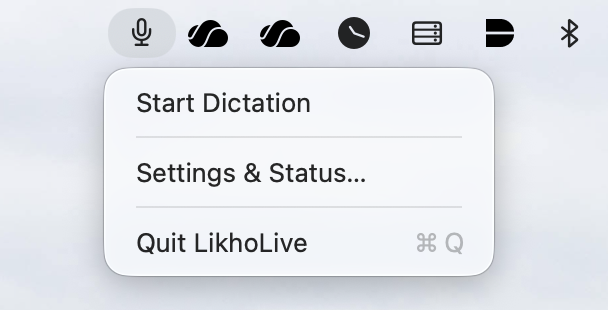
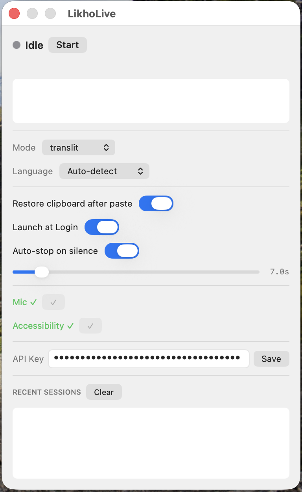
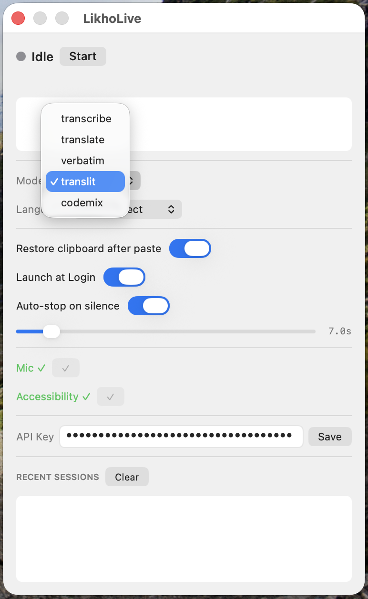
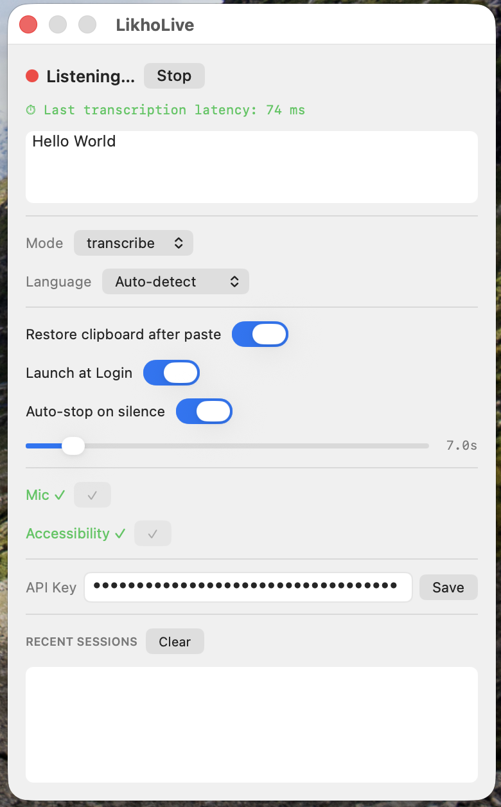
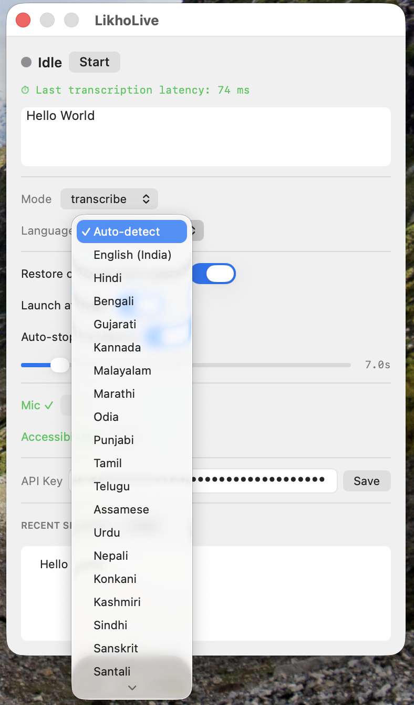

# LikhoLive

Real-time multilingual speech-to-text for macOS — lives in your menu bar, types directly into any app.

  

---

## Screenshots

<p align="center">
  
  
</p>
<p align="center">
  
  
  
</p>

---

## Why I Built This

macOS Dictation works, but only if you're writing in English. The moment you switch to Hindi, Hinglish, or any other Indian language, it falls flat. I needed something that could handle multilingual input — with transliteration, code-mixing, and real translation — and type the result directly into whatever I was working in.

LikhoLive is that tool. It streams your speech to Sarvam's `saaras:v3` model and injects the final transcript wherever your cursor is. No clipboard gymnastics, no copy-paste, just dictation that actually works for multilingual workflows.

---

## vs. macOS Built-in Dictation

| | LikhoLive | macOS Dictation |
|---|---|---|
| Languages | 11 Indian languages + Hinglish | English-first |
| Transliteration | ✓ | ✗ |
| Code-mixing | ✓ | ✗ |
| Translation | ✓ | ✗ |
| API key required | Yes (Sarvam) | No |
| Open source | ✓ | ✗ |

---

## Features

- **Menu bar app** — no Dock icon, always available
- **11 output modes**: transcribe, translate, verbatim, translit, codemix, and more
- **11 Indian languages** supported, including Hinglish
- **Final-only injection** — text is typed into the active app only after the phrase is complete
- **Auto-stop on silence** — configurable 1.5–60s delay, or disable for continuous listening
- **Global hotkey** — toggle dictation from any app (⌘ + ⌥ + K by default)
- **Session history** — recent transcripts shown in the panel
- **Latency display** — see how long each transcription took
- **API key in Keychain** — never stored in plaintext

---

## Requirements

- macOS 13 Ventura or later
- A [Sarvam AI](https://www.sarvam.ai) API key
- Microphone access
- Accessibility access (for typing into other apps)

---

## Install

1. Download the latest `.dmg` from [Releases](../../releases)
2. Open the `.dmg` and drag **LikhoLive** to your Applications folder
3. **Right-click → Open** on first launch (the app is unsigned)
4. Click **Open** when macOS warns about an unidentified developer

> The app is not notarized. This is an open-source personal project — you can review every line of source code here before running it.

---

## First-Run Setup

### 1. Microphone

LikhoLive will ask for microphone access on first launch. If you missed the prompt: **System Settings → Privacy & Security → Microphone → LikhoLive ✓**

### 2. Accessibility

Required for typing into other apps. The panel will show a warning if this is missing.

**System Settings → Privacy & Security → Accessibility → LikhoLive ✓**

### 3. Sarvam API Key

Get a key at [sarvam.ai](https://www.sarvam.ai). Paste it into the **API Key** field in the LikhoLive panel and click **Save**. It is stored in the macOS Keychain and never leaves your machine.

---

## Usage

1. Click the menu bar icon to open the panel
2. Select your **Mode** and **Language**
3. Click **Start** (or use the global hotkey)
4. Speak — text is typed into the previously focused app when each phrase is complete
5. Click **Stop** to end the session

### Output Modes

| Mode | What you get |
|---|---|
| `transcribe` | Speech in the original language |
| `translate` | English translation |
| `verbatim` | Word-for-word, including fillers |
| `translit` | Romanized transliteration |
| `codemix` | Mixed Hindi/English natural output |

---

## How It Works

```
Microphone → AudioCaptureService (16kHz PCM, 60ms chunks)
    → SarvamStreamingClient (WebSocket to saaras:v3)
    → SessionCoordinator (VAD events, silence detection, reconnect)
    → TextInjector (CGEvent keystroke simulation)
```

- Audio is streamed live; transcripts arrive as finals only
- A periodic flush is sent every 6s to force phrase boundaries
- Server-side VAD drives silence detection; auto-stop fires after the configured delay
- On disconnection, the client reconnects with exponential backoff (capped at 2s)

---

## Security & Privacy

- Your audio is sent to Sarvam's API over TLS. No audio is stored locally.
- Your API key is stored in the macOS Keychain (`com.shaugupt.LikhoLive`).
- No analytics, no telemetry, no data collection of any kind.
- All network traffic goes to `api.sarvam.ai`. Arbitrary loads are disabled.

> LikhoLive is not affiliated with or endorsed by Sarvam AI. It uses the Sarvam public API under Sarvam's terms of service.

---

## For Developers

### Build from source

```bash
# Prerequisites: Xcode 16+, macOS 13+ SDK
git clone https://github.com/shaugupt/LikhoLive
cd LikhoLive

# Quick build + install to /Applications
./scripts/dev-run.sh
```

The checked-in `.xcodeproj` works out of the box. To regenerate it from `project.yml`:

```bash
cd LikhoLive
xcodegen generate  # requires: brew install xcodegen
```

### Project structure

```
LikhoLive/
├── AppDelegate.swift
├── main.swift
├── Managers/
│   ├── HotkeyManager.swift
│   └── PermissionManager.swift
├── Models/
│   ├── AppSettings.swift
│   ├── HistoryStore.swift
│   ├── SarvamLanguage.swift
│   └── SarvamMode.swift
├── Services/
│   ├── AudioCaptureService.swift
│   ├── KeychainStore.swift
│   ├── SarvamStreamingClient.swift
│   ├── SessionCoordinator.swift
│   ├── SilenceDetector.swift
│   └── TextInjector.swift
└── UI/
    ├── PanelWindowController.swift
    ├── SettingsViewController.swift
    └── StatusBarController.swift
```

### Logging

```bash
log stream --predicate 'process == "LikhoLive"' --level debug
```

---

## FAQ

**Does it work offline?**
No. Transcription requires a live connection to the Sarvam API.

**Can I use it without an API key?**
No. You need a Sarvam API key. Sign up at [sarvam.ai](https://www.sarvam.ai).

**Does it record or store my audio?**
No. Audio is streamed directly to Sarvam and not stored anywhere locally.

**Why is text sometimes delayed?**
The app injects text only after a phrase is finalized by the model. This avoids mid-sentence corrections appearing in your document.

**Why does it stop after a few seconds of silence?**
Auto-stop is on by default (7s). You can increase the delay or disable it entirely in Settings.

**Does this work in password fields or secure inputs?**
No. macOS blocks CGEvent injection into secure text fields by design.

**The app won't open — "unidentified developer" warning?**
Right-click → Open, then click Open in the dialog. This is a one-time step for unsigned apps.

---

## Scope

LikhoLive is a dictation tool — it transcribes speech and types the result. It is not a meeting recorder, voice agent, screen reader, or general audio processing tool.

---

## Feedback

Issues are welcome. Pull requests may take time to review — this is a personal project.

---

## License

MIT © 2026 shaugupt
